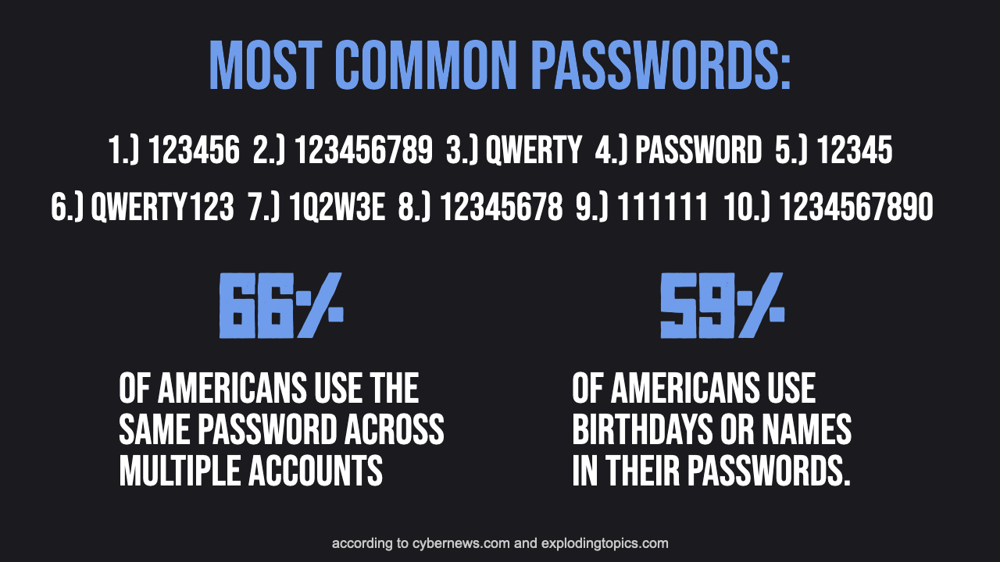

Most people lack strong password security, which puts them at risk of becoming hacked and losing money or other ordeals. 

Strong password security is easier and less troublesome than weak security.

If you don't have strong password security, it's time to implement good practices to protect yourself.

## Password Attacks:

Knowing attack methods to obtain passwords is important to understand the components of password security.

[Or jump straight to the recommended password system.](#password-security-with-password-manager)

### 1.) Brute Force:

Brute force attacks are attempting to guess passwords using every combination of characters.

Long passwords containing all types of characters significantly increase the total number of combinations, making brute force attacks impractical due to the time required to check all possibilities.

### 2.) Personal Data And Dictionary Attack:

Similar to brute force, a dictionary attack involves guessing passwords with common words to decrease the number of combinations.

If the hacker has access to personal data, they may use that because it’s common for passwords to include personal information.

Personal information should not be used in passwords, and passwords should have complex patterns.

### 3.) Credential Stuffing:

Credential stuffing is where a hacker uses known passwords to attempt to access other accounts that person owns.

Using a different password for each account prevents this attack.

### 4.) Keylogger:

A keylogger is a malicious software that allows a hacker to examine key presses on a machine.

Scanning for malware and avoid typing passwords in with the keyboard (auto-fill or virtual keyboards) protects against keyloggers.

### 5.) Phishing: 

Phishing attacks are where hackers trick someone into providing information like logins or credit cards; this is typically done through imitating companies and creating fake websites.

To prevent phishing attacks, verify the authenticity of emails and URLs and avoid clicking on suspicious links or providing personal information.

## Password Security With Password Manager:   

To defend against password attacks I recommend using a password manager. A password manager is software that stores your passwords and commonly provides auto-fill features. Using a password manager is extremely easy and allows for very secure practices. Some password managers are better than others for ease and security.

The password manager that I recommend is **Bitwarden**, which is free.

I would advise against managers like "iCloud Keychain" and "Google Password Manager" because they are more vulnerable if someone has access to your device, and Bitwarden has improved functionality and features. 

## Password Security Practices With Bitwarden:

### 1.) Strong Master Password:

You only need to remember **one** password, the master password. This password should be very secure but still memorizable.

For strong protection, use a long password with 20+ characters and use special symbols. The master password for Bitwarden should be a new password that is not used for any other accounts.

Using device biometrics (don't use a PIN) can save you from having to input this password all the time, but don't forget the master password.

### 2.) Different Passwords For Every Account:

The most important password security practice is using different unique passwords for every account. This is also the hardest for humans to enact.

Bitwarden eliminates the difficult task of remembering passwords and what account they are for, so use a different password for every account.

### 3.) Randomly Generated Passwords:

Because Bitwarden will auto-fill passwords or allow you to easily copy and paste them, having to know your passwords is not necessary. 

    

Using Bitwarden’s password generation, your passwords can be extremely long and use every type of character (letters, capital letters, numbers, and symbols).

This allows your passwords to be an impenetrable wall for brute force attacks.

### 4.) Using 2FA:

2FA should be enabled on every important account possible, but it should certainly be used for Bitwarden.

### 5.) Optional: "Peppering" Important Passwords:

If someone were to obtain your master password for Bitwarden (which should be very difficult) they would have access to all your passwords. 

"Peppering" passwords is adding an extra part in the account's password that's not included in the password Bitwarden has saved. This could be a word or pin. You can add your "pepper" after auto-filling. 

    

This should only be used on your most important accounts, like emails or bank accounts, because typing in your pepper is slightly tedious.

## Potential Issues of Using Bitwarden:

### Using a Public/Unowned Device:

Bitwarden has an online vault to access your password without any extension or app. You can copy and paste passwords into the login.

### Forgot Master Password:

You only need to remember one master password for Bitwarden, if you are worried about forgetting the master password you could write the password down and store it in a safe spot. Bitwarden also can have a password hint.

### Lose Access to Bitwarden Account:

In the unlikely event that you completely lose access to your Bitwarden account for whatever reason, you would have to reset the passwords for all of your accounts. The benefits of using a password manager outweigh this hassle, which will likely not occur.

## Summary:

Secure password practices are easy with a password manager like Bitwarden. Hackers target people with weak password security, having strong security measures will make hackers move on to easier targets. If you are part of the majority of people with weak password security it is time to make changes and secure your passwords.